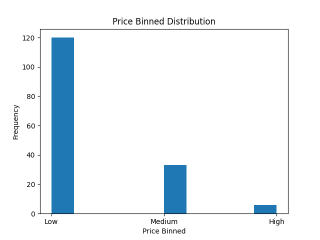
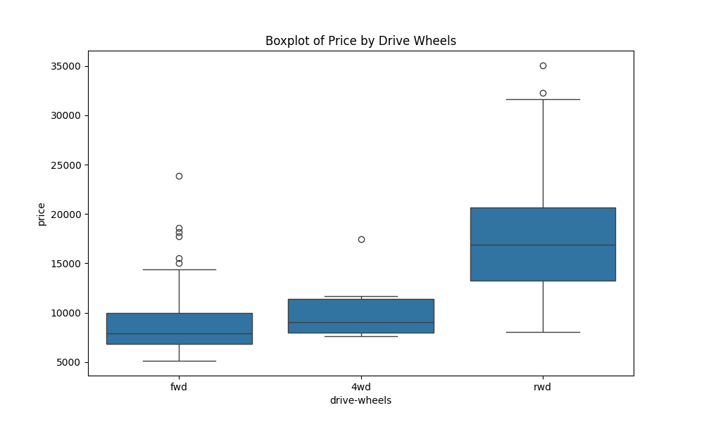

# Analyzing Selling Price of Cars

## Overview
This project analyzes the selling price of cars based on different features like price bins and drive wheels. The analysis includes visualizing price distributions and creating boxplots to understand relationships between car prices and features.

## Files
- `analyzing-selling-price-car.py`: This Python script contains the code used to load, preprocess, and analyze the car price data. It also generates the visualizations.
- `Figure_1.png`: A bar plot representing the distribution of car prices across different price bins (low, medium, high).
- `Figure_2.png`: A boxplot showing the relationship between car prices and drive wheels (fwd, 4wd, rwd).

## Visualizations
### Price Binned Distribution

- **Description**: This bar plot visualizes the frequency of car prices divided into three categories: low, medium, and high. Most cars fall into the low-price bin.

### Boxplot of Price by Drive Wheels

- **Description**: This boxplot shows the distribution of car prices based on drive wheel types (fwd, 4wd, rwd). Cars with rear-wheel drive (rwd) tend to have higher prices compared to front-wheel drive (fwd) and four-wheel drive (4wd).

## Dependencies
To run the code and reproduce the analysis, the following Python packages are required:
- `pandas`
- `matplotlib`
- `seaborn`
- `numpy`

Install the dependencies using:
```bash
pip install pandas matplotlib seaborn numpy
