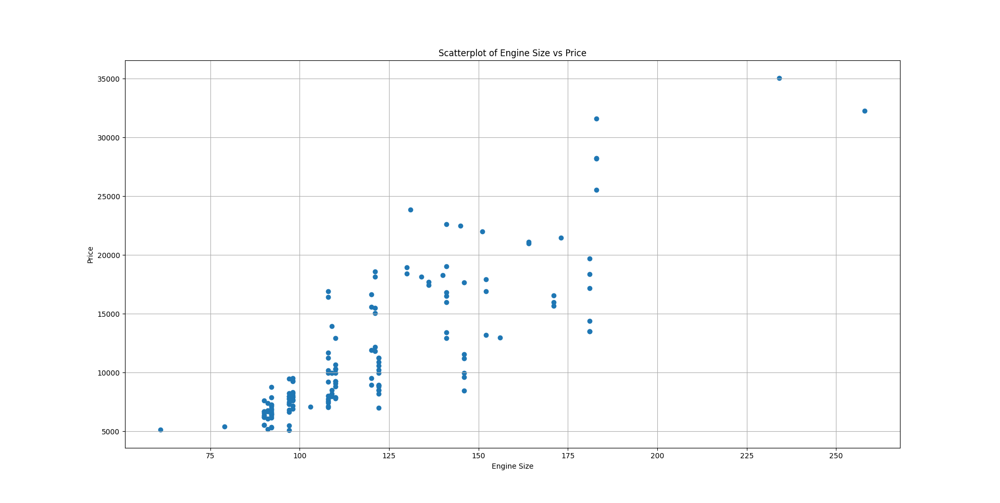
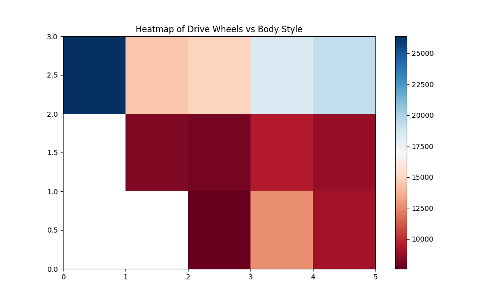
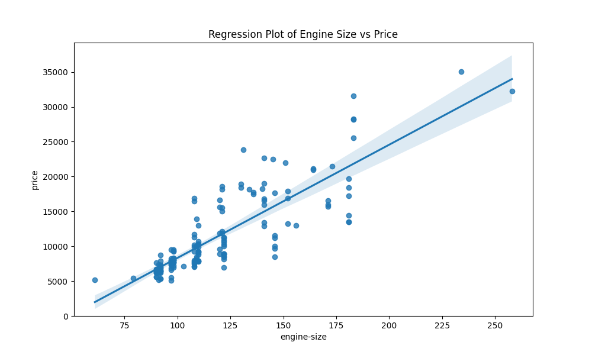

# Analyzing Selling Price of Cars

## Overview
This project aims to analyze the selling price of cars based on various factors like price bins, drive wheels, engine size, and body style. Visualizations like scatter plots, heatmaps, and regression plots are used to explore relationships between these factors and car prices.

## Files
- `analyzing-selling-price-car.py`: This Python script contains the code used to load, preprocess, and analyze the car price data. It also generates the visualizations.
- `Figure_1.png`: Bar plot showing the distribution of car prices across different price bins (low, medium, high).
- `Figure_2.png`: Boxplot displaying car prices by drive wheel types (fwd, 4wd, rwd).
- `Figure_3.png`: Scatter plot illustrating the relationship between engine size and price.
- `Figure_4.png`: Heatmap visualizing the relationship between drive wheels and body style.
- `Figure_5.png`: Regression plot showing the relationship between engine size and price.

## Visualizations
### Price Binned Distribution

- **Description**: This bar plot visualizes the frequency of car prices divided into three categories: low, medium, and high. Most cars fall into the low-price bin.

### Boxplot of Price by Drive Wheels

- **Description**: This boxplot shows the distribution of car prices based on drive wheel types (fwd, 4wd, rwd). Cars with rear-wheel drive (rwd) tend to have higher prices compared to front-wheel drive (fwd) and four-wheel drive (4wd).

### Scatterplot of Engine Size vs Price

- **Description**: This scatter plot illustrates the relationship between engine size and price. Larger engine sizes generally correspond to higher prices, with a noticeable upward trend.

### Heatmap of Drive Wheels vs Body Style

- **Description**: This heatmap shows the relationship between drive wheel types and body style. It helps in identifying any pattern or clustering of car prices based on these two features.

### Regression Plot of Engine Size vs Price

- **Description**: This regression plot shows a strong positive relationship between engine size and price. The trend line confirms that as engine size increases, the price tends to increase as well.

## Dependencies
To run the code and reproduce the analysis, the following Python packages are required:
- `pandas`
- `matplotlib`
- `seaborn`
- `numpy`

Install the dependencies using:
```bash
pip install pandas matplotlib seaborn numpy
